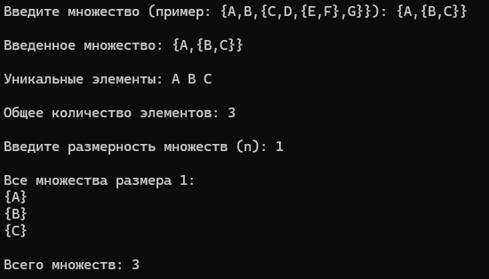
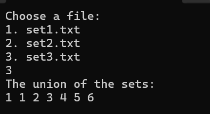
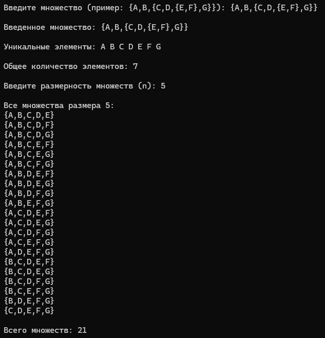

<h1 align="center">Лабораторная работа №2</h1>

## Вариант №5
_**Реализовать программу, формирующую множество равное булеану исходного множества.**_

* ## Цели лабораторной работы:

1. Исследовать свойства структур данных и разработать библиотеку алгоритмов обработки структур данных.
2. Изучение и реализация алгоритма формирования множества, равного булеану произвольного исходного множества.

* ## Задачи лабораторной работы

1. Изучить теоретические аспекты работы с множествами и операцией булеан.
2. Разработать алгоритм формирования множества, равного булеану исходного множества.
3. Провести тестирование программы на различных наборах исходных данных для проверки корректности кода.
4. Проанализировать полученные результаты, сравнить результаты работы программы с ожидаемыми значениями.
5. Разработать GoogleTests, которые проверяют успешное выполнение всех функций.

## Список используемых понятий:

- **`Множество`** — простейшая информационная конструкция и математическая структура,
позволяющая рассматривать какие-то объекты как целое, связывая их.

- **`Элементы множества`** — объекты, связываемые некоторым множеством.

- **`Булеан`** — это множество всех подмножеств C, включая пустое множество и само множество C.


# Описание алгоритмов
## Файл Header.h
Заголовочный файл Header.h представляет собой часть программы, связанной с обработкой множеств и их свойствами. Он содержит декларации функций и подключает необходимые библиотеки.
```c++
#pragma once
#ifndef HEADER_H 
#define HEADER_H 
  
#include <iostream>
#include <vector>
#include <string>
#include <fstream>

using namespace std;
 
// Декларации функций
bool IsBalanced(const string& input);
bool IsValidCharacter(char c);
bool ValidateStructure(const string& input);
int Add(vector<string>& Set, const string& input_str);
int Check_Elements(const vector<string>& set);
void PrintSubset(const vector<string>& subset);
void Generate_Boolean(const vector<string>& set, vector<vector<string>>& boolean, vector<string>& el_of_boolean, int index);
void RemoveOuterBraces(string& line);

#endif

```
## Файл main.cpp
Файл main.cpp считывает строки из текстового файла, обрабатывает данные множества, формирует булеан и выводит результат.
```c++
#include "Header.h"

int main() {
    setlocale(LC_ALL, "ru");

    ifstream fin("Set.txt");
    if (!fin.is_open()) {
        cout << "Ошибка открытия файла!" << endl;
        return 1;
    }

    string line;
    while (getline(fin, line)) {
        string noSpaces;
        for (char c : line) {
            if (c != ' ') noSpaces += c;
        }
        line = noSpaces;

        size_t equalPos = line.find('=');
        if (equalPos != string::npos) {
            line = line.substr(equalPos + 1);
        }

        if (!ValidateStructure(line)) {
            cout << "Ошибка: некорректное множество \"" << line << "\"." << endl;
            continue;
        }

        RemoveOuterBraces(line);

        vector<string> set;
        vector<vector<string>> boolean;
        vector<string> el_of_boolean;

        if (Add(set, line) || Check_Elements(set)) continue;

        cout << "Введённое множество: { ";
        for (size_t i = 0; i < set.size(); i++) {
            cout << set[i];
            if (i < set.size() - 1) cout << ", ";
        }
        cout << " }" << endl;

        Generate_Boolean(set, boolean, el_of_boolean, 0);

        cout << "Булеан заданного множества:\n";
        for (const auto& s : boolean) {
            PrintSubset(s);
            cout << endl;
        }
    }

    fin.close();
    return 0;
}


```

## Файл Set.txt
В файл Set.txt записываются исходные множества для формирования булеана.
```c++
A={o,{},A}
a={@, wew, *}
B={2, <1,a>}

```
## Файл Source.cpp(описание функций в нём)
Файл представляет реализацию программы для работы с множествами, включающую их валидацию, обработку, генерацию булеана (множества всех подмножеств) и форматированный вывод.

### bool IsBalanced(Проверка на сбалансированность всех типов скобок)
 * Проверяет, сбалансированы ли скобки в строке (фигурные {}, угловые <> и круглые ()).
 * Алгоритм:
 * Использует стек (vector<char>).
 * При нахождении открывающей скобки добавляет её в стек.
 * При нахождении закрывающей скобки проверяет, соответствует ли она последней открытой скобке (извлекаемой из стека).
 * Если стек не пуст после прохода строки, или закрывающая скобка не соответствует открывающей, строка считается несбалансированной.
```c++
bool IsBalanced(const string& input) {
    vector<char> stack;

    for (char c : input) {
        if (c == '{' || c == '<' || c == '(') {
            stack.push_back(c);
        }
        else if (c == '}' || c == '>' || c == ')') {
            if (stack.empty()) return false;

            char openBracket = stack.back();
            stack.pop_back();

            if ((c == '}' && openBracket != '{') ||
                (c == '>' && openBracket != '<') ||
                (c == ')' && openBracket != '(')) {
                return false;
            }
        }
    }
    return stack.empty();
}


```
### bool IsValidCharacter(Проверка на допустимые символы)
 * Проверяет, является ли символ допустимым (буква, цифра, пробел или один из предопределённых специальных символов {}, <, >, (), ,).
 * Алгоритм:
 * Использует диапазоны значений символов и сравнения.

```c++
bool IsValidCharacter(char c) {
    return (c >= 'a' && c <= 'z') || (c >= 'A' && c <= 'Z') || (c >= '0' && c <= '9') ||
        c == '{' || c == '}' || c == '<' || c == '>' ||
        c == '(' || c == ')' || c == ',' || c == ' ';
}
```
### bool ValidateStructure(Проверка структуры множества) 
* Проверяет, соответствует ли структура строки правилам множества.
* Алгоритм:
* Итерируется по каждому символу строки, используя функцию IsValidCharacter.
* Если встречается недопустимый символ, возвращает ошибку.
* Дополнительно вызывает функцию IsBalanced для проверки корректности расстановки скобок.
```c++
bool ValidateStructure(const string& input) {
    for (char c : input) {
        if (!IsValidCharacter(c)) {
            cout << "Ошибка: обнаружен недопустимый символ \"" << c << "\"." << endl;
            return false;
        }
    }
    return IsBalanced(input);
}
```
### int Add(Добавление элементов множества)
* Разбивает строку множества на отдельные элементы и добавляет их в вектор Set.
*  Алгоритм:
*  Идёт посимвольно по строке, отслеживая уровни вложенности скобок (braceCount, angleCount, roundCount).
*  Если встречается символ ,, проверяет, находится ли он вне вложенных структур; если да, завершает текущий элемент и добавляет его в множество.
*  После завершения строки проверяет, сбалансированы ли все типы скобок.
```c++
int Add(vector<string>& Set, const string& input_str) {
    string currentElement;
    int braceCount = 0, angleCount = 0, roundCount = 0;

    for (char s : input_str) {
        if (s == '{') braceCount++;
        if (s == '}') braceCount--;
        if (s == '<') angleCount++;
        if (s == '>') angleCount--;
        if (s == '(') roundCount++;
        if (s == ')') roundCount--;

        if (s == ',' && braceCount == 0 && angleCount == 0 && roundCount == 0) {
            if (!currentElement.empty()) {
                Set.push_back(currentElement);
                currentElement.clear();
            }
        }
        else {
            currentElement.push_back(s);
        }
    }

    if (!currentElement.empty()) {
        Set.push_back(currentElement);
    }

    return (braceCount == 0 && angleCount == 0 && roundCount == 0) ? 0 : 1;
}
```
### int Check_Elements(Проверка на уникальность элементов) 
* Проверяет множество на наличие повторяющихся элементов. 
* Алгоритм:
* Использует два вложенных цикла для сравнения каждого элемента множества с остальными.
* Если обнаруживаются дубликаты, возвращает ошибку.
```c++
int Check_Elements(const vector<string>& set) {
    for (size_t i = 0; i < set.size(); i++) {
        for (size_t j = i + 1; j < set.size(); j++) {
            if (set[i] == set[j]) {
                cout << "Ошибка: множество содержит повторяющийся элемент \"" << set[i] << "\"." << endl;
                return 1;
            }
        }
    }
    return 0;
}
```
### void PrintSubset(Печать подмножества) 
* Форматированно выводит подмножество на консоль.
* Алгоритм:
* Итерируется по элементам подмножества, добавляя их в вывод с разделением через запятую.
```c++
void PrintSubset(const vector<string>& subset) {
    cout << "{ ";
    for (size_t j = 0; j < subset.size(); j++) {
        cout << subset[j];
        if (j < subset.size() - 1) cout << ", ";
    }
    cout << " }";
}
```
### void Generate_Boolean(Генерация булеана) 
* Генерирует булеан множества (все возможные подмножества).
* Алгоритм:
* Рекурсивный метод.
* На каждом шаге добавляет текущее подмножество (el_of_boolean) в итоговый вектор булеана.
* Идёт по элементам множества с текущего индекса, добавляя элемент в подмножество и вызывая функцию рекурсивно для следующего индекса.
* После возврата из рекурсии удаляет последний добавленный элемент из текущего подмножества.
```c++
void Generate_Boolean(const vector<string>& set, vector<vector<string>>& boolean, vector<string>& el_of_boolean, int index) {
    boolean.push_back(el_of_boolean);
    for (size_t i = index; i < set.size(); i++) {
        el_of_boolean.push_back(set[i]);
        Generate_Boolean(set, boolean, el_of_boolean, i + 1);
        el_of_boolean.pop_back();
    }
}
```
### void RemoveOuterBraces(Удаление внешних фигурных или угловых скобок) 
* Удаляет внешние фигурные {} или угловые <> скобки из строки.
* Алгоритм:
* Если первый и последний символы строки — парные открывающая и закрывающая скобки, обрезает строку, удаляя эти символы.
```c++
void RemoveOuterBraces(string& line) {
    if ((line.front() == '{' && line.back() == '}') || (line.front() == '<' && line.back() == '>')) {
        line = line.substr(1, line.size() - 2);
    }
}
```

<h1 align="center">Примеры реализации программы</h1>

* ### Тест №1
  Для множества А={0, {}, A}


* ### Тест №2
   Для множества B={1, 2}


* ### Тест №3
   Для множества A={15, <1, 2>}


* ### Тест №4
   Для множества A={{, wew, *}


* ### Google Test 


<h1 align="center">Вывод:</h1>

В процессе лабораторной работы был создан алгоритм для формирования множества, которое соответствует булеану исходного множества.


## Используемые источники:

* [Задание](https://drive.google.com/drive/folders/1_xy849HXgTDetxSMlFd0KikTBo8-xalN)
* [Введение в теорию множеств](om/ru/articles/457312/)
* [Примеры реализаций]([https://learn.microsoft.com/ru-ru/cpp/cpp/errors-and-exception-handling-modern-cpp?view=msvc-170](https://www.cyberforum.ru/cpp-beginners/thread2506254.html))
* [Сборка проектов в C++]([https://purecodecpp.com/archives/2751](https://habr.com/ru/companies/ruvds/articles/871940/))
* [GoogleTests](https://github.com/google/googletest/blob/main/docs/primer.md)
