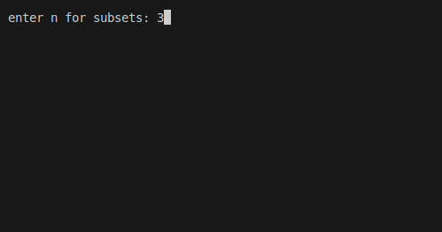
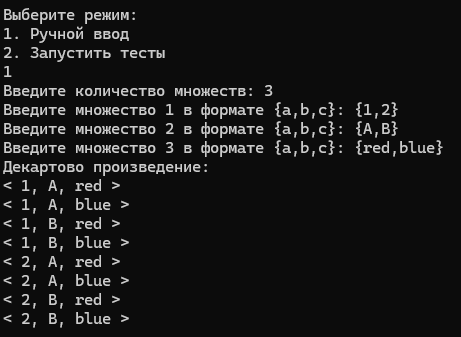
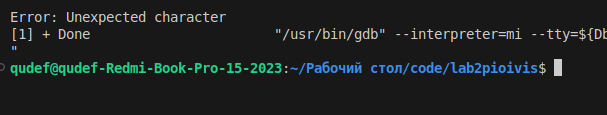
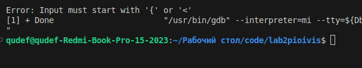
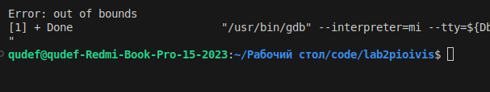
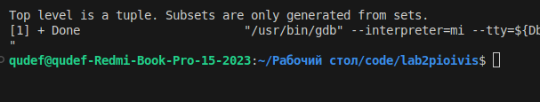

# Лабораторная работа №2
Работа с вложенными множествами в моей программе осуществляется с помощью библиотеки std::variant С++. Суть в том, что пользователь вводит в текстовый файл вложенное множество, а программа обрабатывает его и выполняет индивидуальное задание. Мое индивидуальное задание состоит в том, чтобы разбить множество на подмножества размера n, то есть составить булеан.



Программа запрашивает у пользователя размер n получаемых подмножеств. Ввод находится в текстовом файле input.txt.

```
{1,2,3,<1,2>,{4,5}}
```
На вот такой ввод, программа выводит в текстовый файл все возможные множества размера 3 из заданных элементов.

```
all subsets of size 3:
{1 2 3 }
{1 2 {4, 5} }
{1 2 <1, 2> }
{1 3 {4, 5} }
{1 3 <1, 2> }
{1 {4, 5} <1, 2> }
{2 3 {4, 5} }
{2 3 <1, 2> }
{2 {4, 5} <1, 2> }
{3 {4, 5} <1, 2> }
```

Количество полученных множеств равно количеству сочетаний size по n, где size это размер исходного множества.

Входная строка обрабатывается через парсер и для выполнения индивидуальоного задания, множество представляется как вектор с типом данных various.

```
struct various;
using Set = set<various>;
using Tuple = vector<various>;
using Element = variant<int, Set, Tuple>;

struct various {
    Element value;
    bool operator<(const various& element) const {
        return value < element.value;
    }
};
```
После чего вызывается функция getAllSubsets(), которая записывает все уникальные подмножества в отдельный вектор и затем выводит их в текстовый файл output.txt.


Также есть обработка ошибок ввода:

1.
```
{1,2,3,<},{}}
```



2.
```
{1,2,3,{1,2,<1,3},>}
```


3.
```
1,2,{}
```


4.
```
{1,2,{}
```


5.
```
<1,2,{}>
```



# Вывод
В процессе выполнения лабораторной работы я улучшил свои навыки программирования на языке С++ и научился работать в библиотеке std::variant. Так же научился обрабатывать ошибки пользовательского ввода.