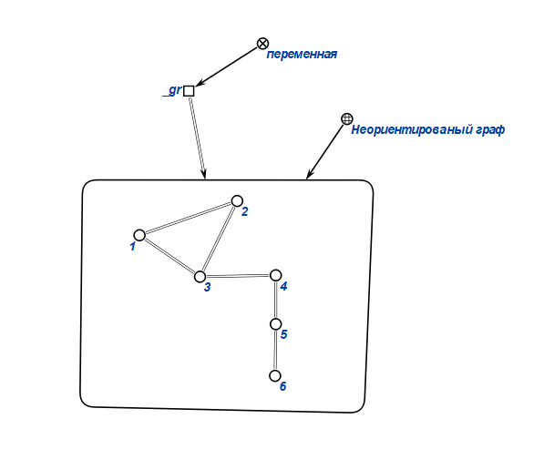
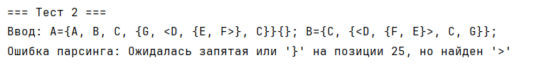
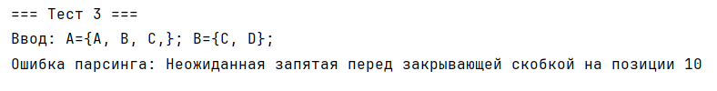
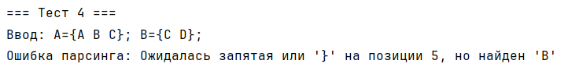
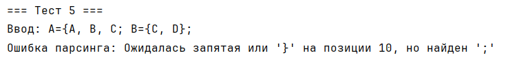
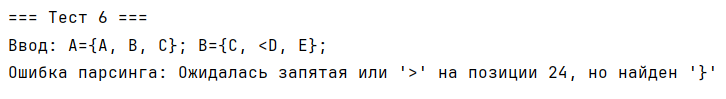

# Лабораторная работа №2

## Цели

- Изучить основные понятия, связанные с множествами, включая вложенные и упорядоченные множества.
- Ознакомиться с реализацией операций над множествами (пересечение, сравнение).
- Научиться реализовывать парсер для специального синтаксиса множеств.

## Задачи

- Выполнить индивидуальный вариант лабораторной работы.
- Перенести решение на язык программирования Java, реализовав полноценный парсер и логику операций.

## Вариант

Для выполнения лабораторной работы был выдан вариант **пересечения вложенных множеств**, поддерживающих как упорядоченные (`<...>`) так и неупорядоченные (`{...}`) структуры. Для реализации использован язык **Java** и стандартные библиотеки.

---

## Структура проекта

```
src/
  ├── SetIntersectionApp.java
  ├── SimpleParser.java
  ├── SetStructure.java
  └── Element.java
```

*Рекомендуется добавить изображение структуры проекта*

---

## Теоретическая справка: Множество

**Множество** — фундаментальное математическое понятие, описывающее совокупность объектов, объединённых некоторым свойством.

В данной работе множество может содержать как простые элементы, так и другие множества (вложенность не ограничена). Также поддерживаются **упорядоченные** множества (`<...>`) и **неупорядоченные** (`{...}`).

---

## Описание реализации

Программа позволяет:

- Задать произвольное количество множеств в виде строки или в текстовом файле:
  ```
  A={A, B, C, {G, <D, {E, F}>, C}}; B={C, {<D, {F, E}>, C, G}};
  ```
- Корректно распознать и обработать вложенные и упорядоченные структуры.
- Вычислить пересечение всех заданных множеств.
- Обработать синтаксические ошибки (лишние запятые, незакрытые скобки и т.д.).

### Основные классы

### Основные классы проекта

#### `Element`

Класс представляет **элемент множества**. Элемент может быть:
- простым именем (например, `"A"`, `"B"`);
- вложенным множеством (неупорядоченным или упорядоченным).

**Поля:**
- `boolean isSet` — определяет, является ли элемент множеством (`true`) или простым именем (`false`);
- `boolean isOrdered` — если элемент — множество, указывает тип: `true` для упорядоченного (`< >`), `false` для неупорядоченного (`{ }`);
- `String name` — имя элемента (если это не множество);
- `SetStructure nestedSet` — вложенное множество, если элемент — множество.

**Основные методы:**
- `toString()` — строковое представление элемента (автоматически выводит как имя, множество в скобках `{...}` или `<...>`);
- `equals(Object obj)` — сравнение элементов с учетом вложенности и типа.

---

#### `SetStructure`

Класс для представления **множества элементов** (в том числе вложенных множеств).

**Поля:**
- `ArrayList<Element> elements` — список всех элементов множества (могут быть простыми или вложенными).

**Основные методы:**
- `addElement(Element e)` — добавить элемент в множество;
- `contains(Element e)` — проверить, содержится ли элемент во множестве (с учетом сравнения через `equals`);
- `toString()` — строковое представление множества (перечисляет элементы через запятую, обрамляет в скобки, ставит точку с запятой);
- `equals(Object obj)` — сравнивает два множества (равны, если содержат одинаковые элементы).

---

#### `SimpleParser`

Класс отвечает за **синтаксический разбор (парсинг) строки с определениями множеств** и их элементов.

**Поля:**
- `String text` — исходная строка, которую нужно распарсить;
- `int index` — текущая позиция в строке для разбора;
- `char currentChar` — текущий символ для разбора;
- `Map<String, SetStructure> namedSets` — словарь для хранения множеств с именами (например, `A={...};`).

**Основные методы:**
- `moveToNextChar()` — перейти к следующему символу;
- `skipSpaces()` — пропустить все пробельные символы;
- `readName()` — прочитать имя элемента или множества;
- `expectChar(char expected)` — убедиться, что следующий символ совпадает с ожидаемым;
- `readSet()` — распарсить множество (`{...}` или `<...>`);
- `readElement()` — распарсить элемент (имя или вложенное множество);
- `parseOneSet()` — распарсить одно именованное множество с записью в карту;
- `validateEndOfInput()` — убедиться, что строка полностью распознана (нет лишних символов).

---

#### `SetIntersectionApp`

**Главный класс** — точка входа в программу.

**Назначение:**
- Запускает тестовые примеры (или обрабатывает входные данные).
- Для каждой строки входа вызывает `SimpleParser`, разбирает все множества.
- Вычисляет пересечение всех множеств через метод `intersectSets(List<SetStructure>)`.
- Выводит результат (или ошибку) на экран.

**Основные методы:**
- `main(String[] args)` — запускает выполнение тестовых сценариев и обработку ввода;
- `processInput(String input)` — парсит строку, находит множества, выводит результат пересечения;
- `intersectSets(List<SetStructure> sets)` — реализует пересечение: возвращает новое множество, куда включаются элементы, которые есть во всех исходных множествах.

---

#### `SetStructure`

Класс для представления **множества элементов** (в том числе вложенных множеств).

**Поля:**
- `ArrayList<Element> elements` — список всех элементов множества (могут быть простыми или вложенными).

**Основные методы:**
- `addElement(Element e)` — добавить элемент в множество;
- `contains(Element e)` — проверить, содержится ли элемент во множестве (с учетом сравнения через `equals`);
- `toString()` — строковое представление множества (перечисляет элементы через запятую, обрамляет в скобки, ставит точку с запятой);
- `equals(Object obj)` — сравнивает два множества (равны, если содержат одинаковые элементы).

---
#### `SimpleParser`

Класс отвечает за **синтаксический разбор (парсинг) строки с определениями множеств** и их элементов.

**Поля:**
- `String text` — исходная строка, которую нужно распарсить;
- `int index` — текущая позиция в строке для разбора;
- `char currentChar` — текущий символ для разбора;
- `Map<String, SetStructure> namedSets` — словарь для хранения множеств с именами (например, `A={...};`).

**Основные методы:**
- `moveToNextChar()` — перейти к следующему символу;
- `skipSpaces()` — пропустить все пробельные символы;
- `readName()` — прочитать имя элемента или множества;
- `expectChar(char expected)` — убедиться, что следующий символ совпадает с ожидаемым;
- `readSet()` — прочитать множество (`{...}` или `<...>`);
- `readElement()` — прочитать элемент;
- `validateEndOfInput()` — убедиться, что строка полностью распознана (нет лишних символов).

---

#### `SetIntersectionApp`

**Главный класс** — точка входа в программу.

**Назначение:**
- Запускает тестовые примеры (или обрабатывает входные данные).
- Для каждой строки входа вызывает `SimpleParser`, разбирает все множества.
- Вычисляет пересечение всех множеств через метод `intersectSets(List<SetStructure>)`.
- Выводит результат (или ошибку) на экран.

**Основные методы:**
- `main(String[] args)` — запускает выполнение тестовых сценариев и обработку ввода;
- `processInput(String input)` — парсит строку, находит множества, выводит результат пересечения;
- `intersectSets(List<SetStructure> sets)` — реализует пересечение: возвращает новое множество, куда включаются элементы, которые есть во всех исходных множествах.

---

## Примеры тестирования

**Входная строка:**
```
A={A, B, C, {G, <D, {E, F}>, C}}; B={C, {<D, {F, E}>, C, G}};
```
**Результат пересечения:**
```
{C,{G,<D,{E,F}>,C}};
```


**Некорректный ввод:**
```
A={A, B, C, {G, <D, {E, F>}, C}}{}; B={C, {<D, {F, E}>, C, G}};
```
**Вывод:**



```
A={A, B, C,}; B={C, D};
```
**Вывод:**



```
A={A B C}; B={C D};
```
**Вывод:**



```
A={A, B, C; B={C, D};
```
**Вывод:**



```
A={A, B, C}; B={C, <D, E};
```
**Вывод:**




---

## Вывод

В ходе выполнения лабораторной работы:

1. Изучена работа с множествами, включая вложенные и упорядоченные структуры.
2. Разработан парсер, корректно разбирающий сложные выражения.
3. Реализовано вычисление пересечения множеств произвольной вложенности на языке Java.

---

## Используемые источники

- [Википедия](https://ru.wikipedia.org/wiki/Множество)
- [Документация Java SE](https://docs.oracle.com/javase/8/docs/)

---
