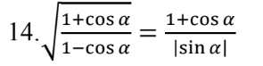
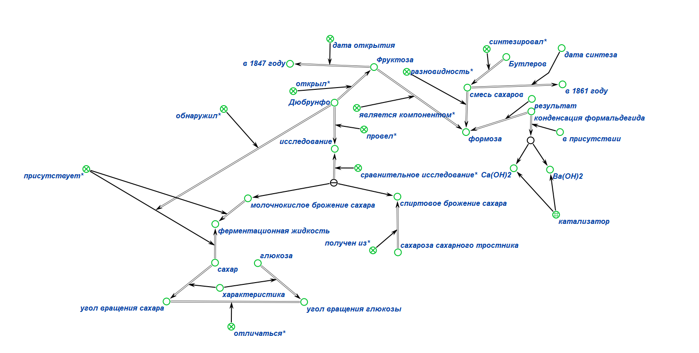
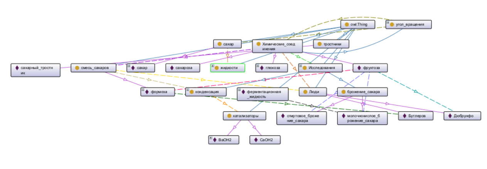
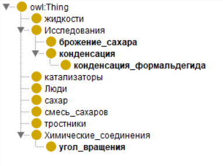
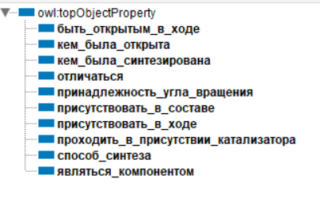
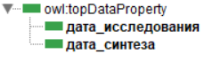
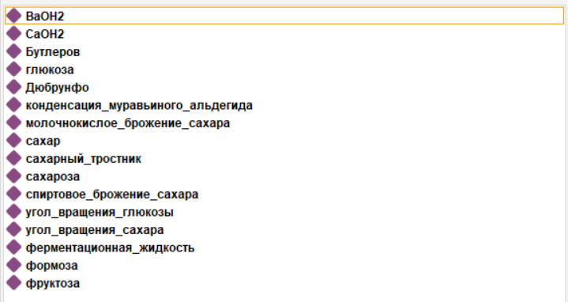
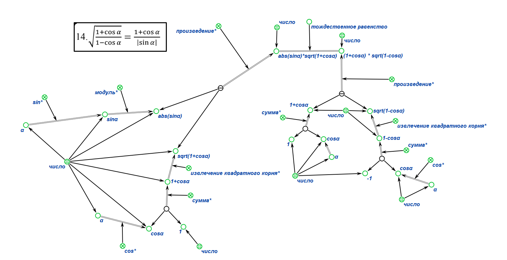

## Практическое задание по предмету «Представление и обработка информации в интеллектуальных системах».

## Цель:
* Научиться формализовать текст
* Познакомиться с редакторами для формализации текста

##  Задачи:
* Выполнить свои варианты в двух редакторах  KBE и Protege

<hr></hr>

## Вариант: №11 и  №14
### Для первой части практического задания был выдан вариант **№11**

```
Фруктоза была открыта Дюбрунфо в 1847 г. в ходе сравнительного исследования
молочнокислого и спиртового брожения сахара, полученного из сахарозы сахарного тростника.
Дюбрунфо обнаружил, что в ходе молочнокислого брожения в ферментационной жидкости
присутствует сахар, угол вращения которого отличается от уже известной в то время глюкозы.
В 1861 году Бутлеров синтезировал смесь сахаров — «формозу» — конденсацией
формальдегида (муравьиного альдегида) в присутствии катализаторов: Ba(OH)2 и Ca(OH)2,
одним из компонентов этой смеси является фруктоза.
```

### Для второй части практического задания был выдан вариант **№14**

</img>

## Выполнение работы (1 задание):

**1)** **KBE**

</src>

<p></p>

**2)** **Protege**

</img>

### Структра проекта в  Protege:

**1) Classes**

</img>

**2) Object properties**

</img>

**3) Data properties**

</img>

**4) Individuals**

</img>

## Выполнение работы (2 задание):

**KBE**
</img>

## Вывод:

Изучил правила формализации текста, выполнил задания, выданные преподавателем, в редакторах **KBE** и **Protege**.

## Используемая литература

* <a href="https://protegeproject.github.io/protege/"> Установка и синтаксис</a>
* <a href="https://drive.google.com/drive/folders/1zQF0KtRTaKJJu4rvXSxls0AlobdYUDx5"> Небольшой гайд по Protege  и KBE, материалы с заданием