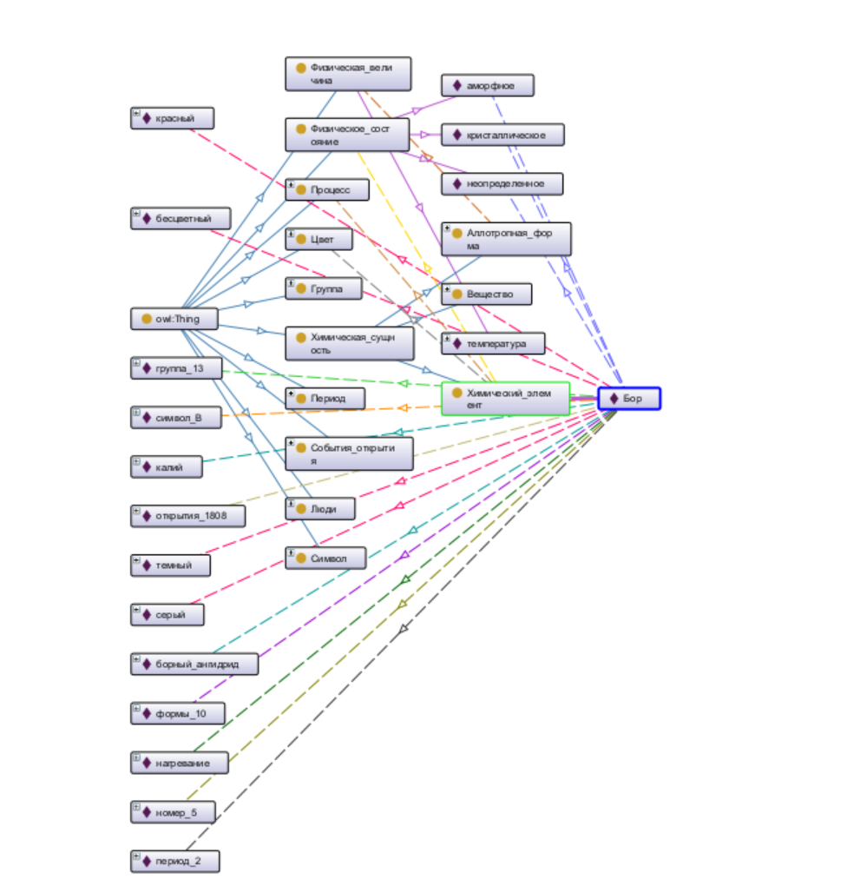
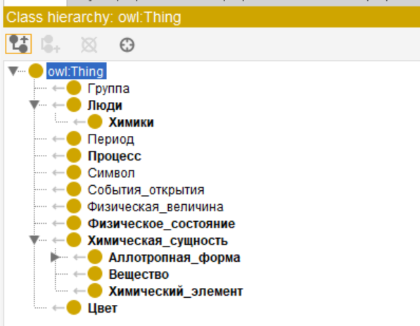
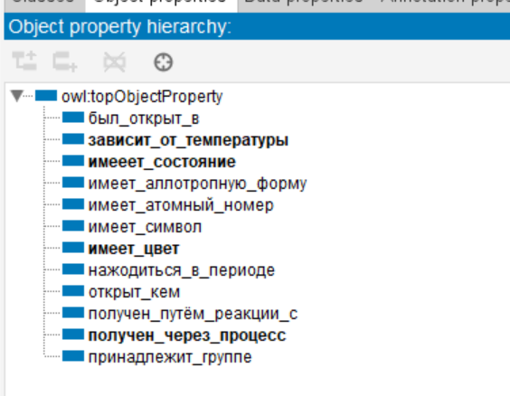
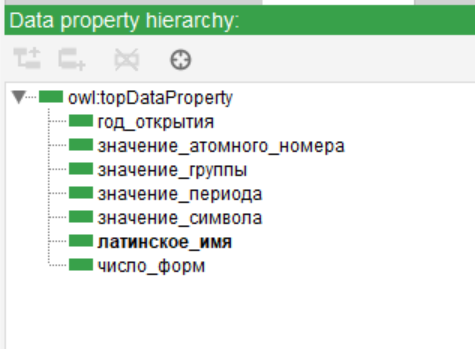
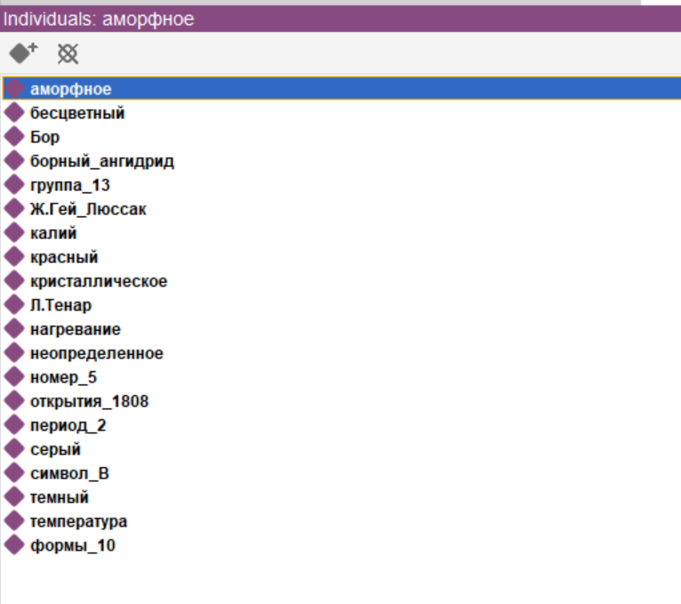
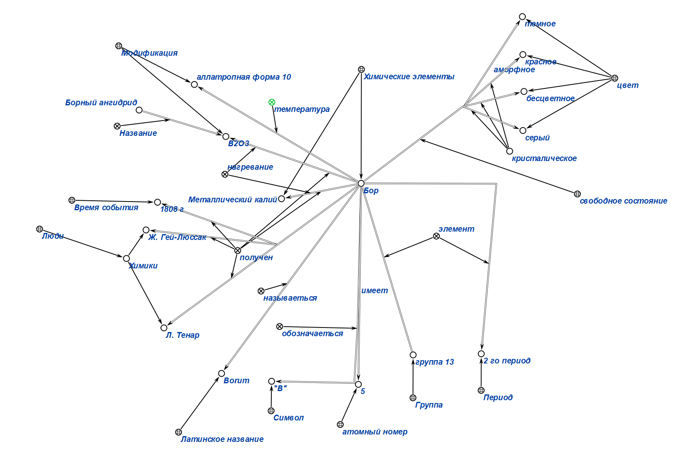
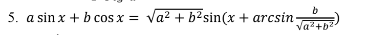
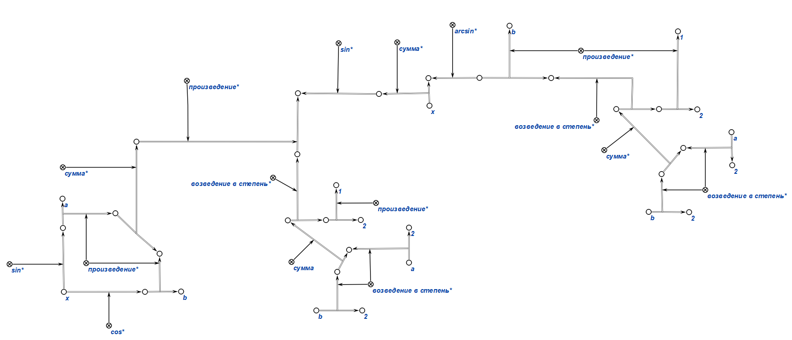

## Практическое задание

## Цель:
* Освоить принципы формализации текста.

* Изучить и ознакомиться с инструментами, предназначенными для формализации текстовой информации.

## Задание
1. Заданный текст (условие задачи) формализовать в двух вариантах:
a. при помощи стандартов консорциума W3C, используя редактор Protégé
b. при помощи стандартов технологии OSTIS, используя редактор KBE и
язык SCg 

##### Вариант: №26 и  №5

#### Protege

``Бор — элемент 13-й группы, второго периода периодической системы химических элементов с атомным номером 5. Обозначается символом B (лат. Borum). В свободном состоянии бор — бесцветное, серое или красное кристаллическое либо тёмное аморфное вещество. Известно
более 10 аллотропных модификаций бора, образование и взаимные переходы которых определяются температурой, при которой бор был получен. Впервые получен в 1808 году французскими химиками Ж. Гей-Люссаком и Л. Тенаром нагреванием борного ангидрида B2O3
с металлическим калием.``

###### Class

###### Object property

###### Data property

###### Individuals

***

 #### KBE (SCg)

***

## Используемые источники

[Гайд 2](https://drive.google.com/drive/folders/1YcFCikH9WaXeDmWPGPtRTk34FsCmLkVl)

[Гайд 2]("https://drive.google.com/drive/folders/1zQF0KtRTaKJJu4rvXSxls0AlobdYUDx5")