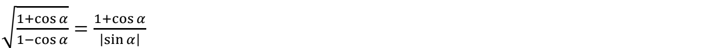
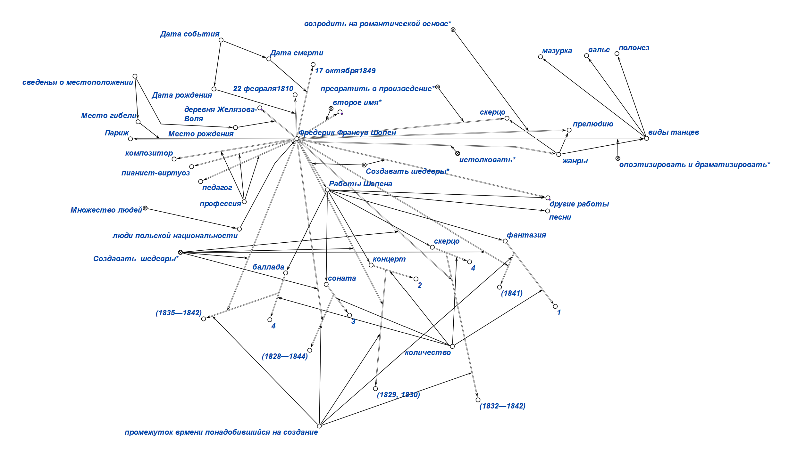
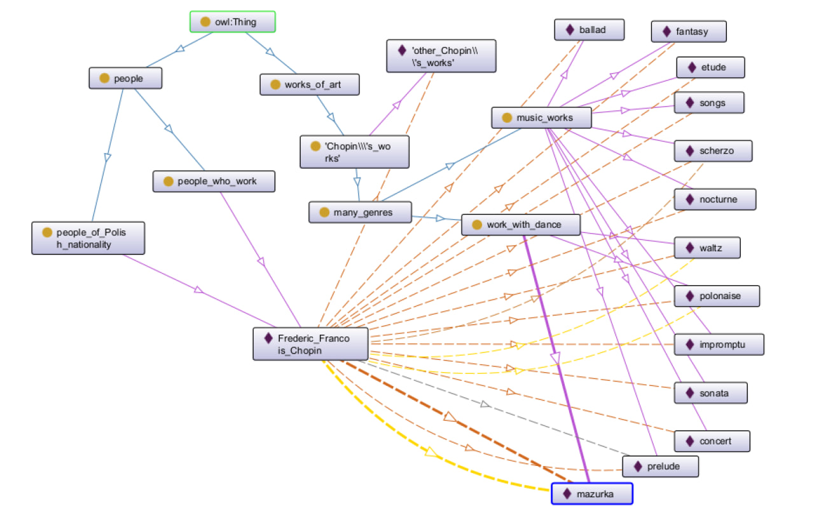
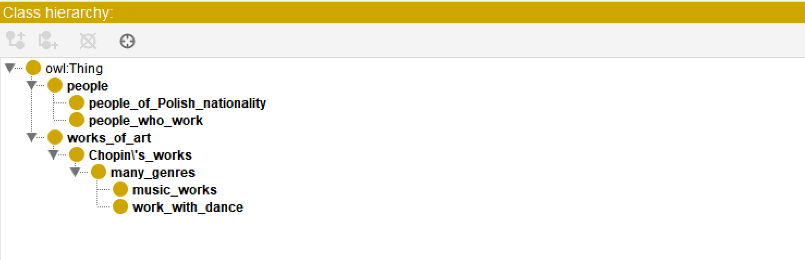
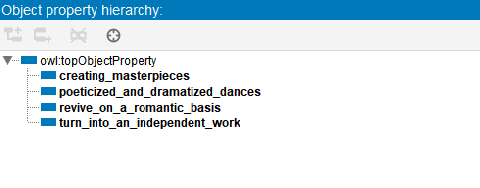
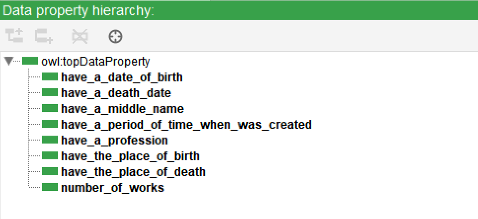
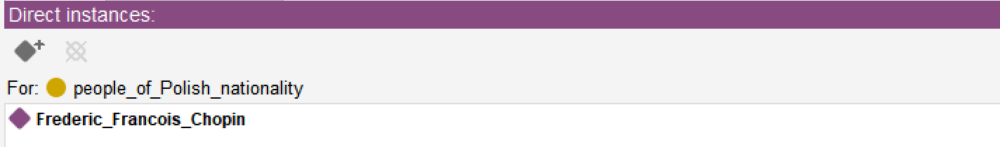
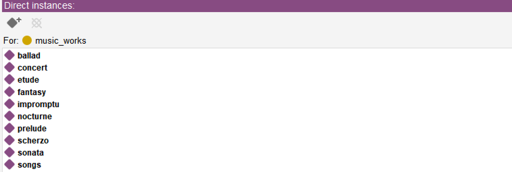
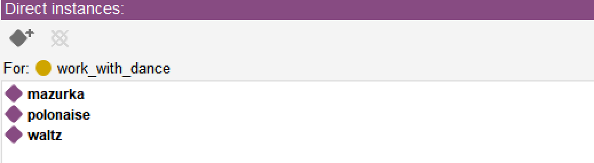
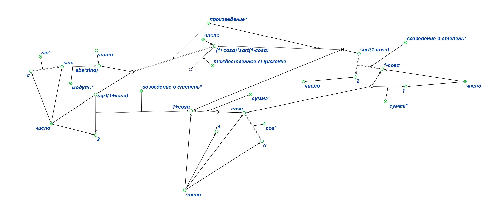

## Практическое задание по предмету «Представление и обработка информации в интеллектуальных системах». ##

## Цель:
* Научиться формализовать текст
* Познакомиться с редакторами для формализации текста

##  Задачи:
* Выполнить свои варианты в двух редакторах  KBE и Protege

## Вариант: №23 и  №14
### Для первой части практического задания был выдан вариант **№23**

```
Фредерик Франсуа Шопен (Фредерик Францишек Шопен; 22 февраля1810, деревня Желязова-Воля, близ Варшавы — 17 октября1849, Париж) — польский композитор и пианист-виртуоз, педагог. По-новому истолковал многие жанры: возродил на романтической основе прелюдию, опоэтизировал и драматизировал танцы — мазурку, полонез, вальс; превратил скерцо в
самостоятельное произведение. Среди сочинений Шопена 2 концерта(1829, 1830), 3 сонаты (1828—1844), фантазия (1841), 4 баллады (1835—1842), 4 скерцо (1832—1842), экспромты, ноктюрны, этюды, вальсы, мазурки, полонезы, прелюдии и другие произведения для
фортепиано; песни.
```

### Для второй части практического задания был выдан вариант **№14**




## Выполнение работы (1 задание):

**1)** **KBE**



<p></p>

**2)** **Protege**



### Структра проекта в  Protege

**1) Classes**



**2) Object properties**



**3) Data properties**



**4) Individuals by class**


<p></p>

<p></p>

<p></p>



## Выполнение работы (2 задание):

**KBE**




## Вывод:

Изучил правила формализации текста, выполнил задания, выданные преподавателем, в редакторах **KBE** и **Protege**.

## Используемая литература

* <a href="https://protegeproject.github.io/protege/"> Установка и синтаксис</a>
* <a href="https://drive.google.com/drive/folders/1zQF0KtRTaKJJu4rvXSxls0AlobdYUDx5"> Небольшой гайд по Protege  и KBE, материалы с заданием