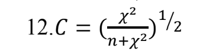
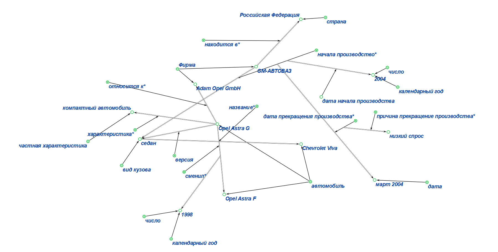
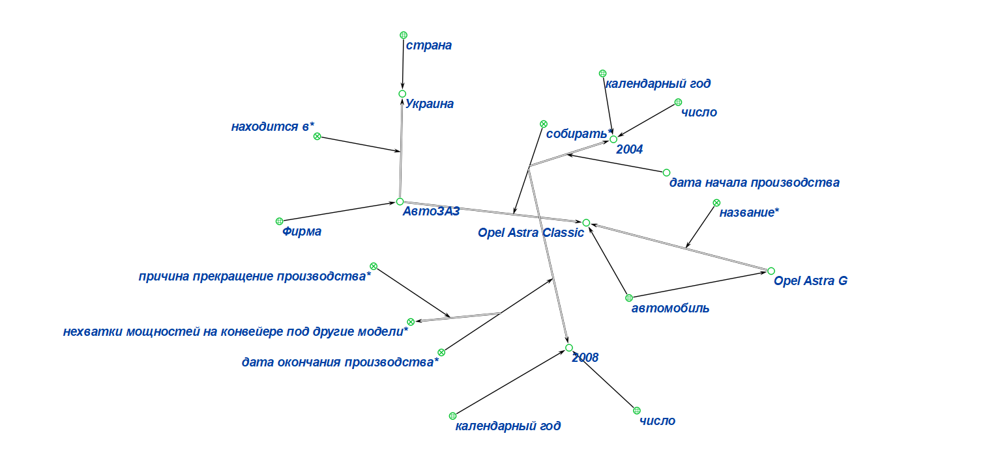
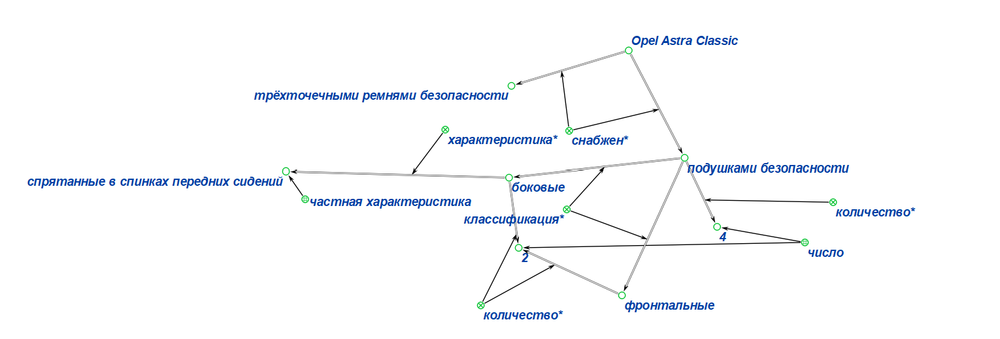
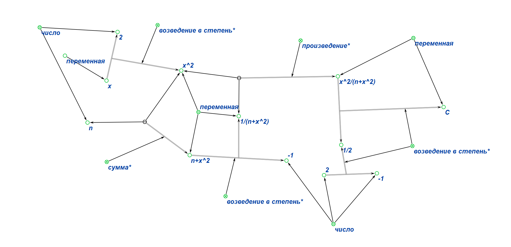
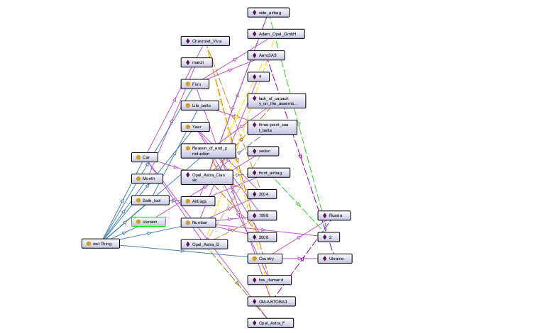
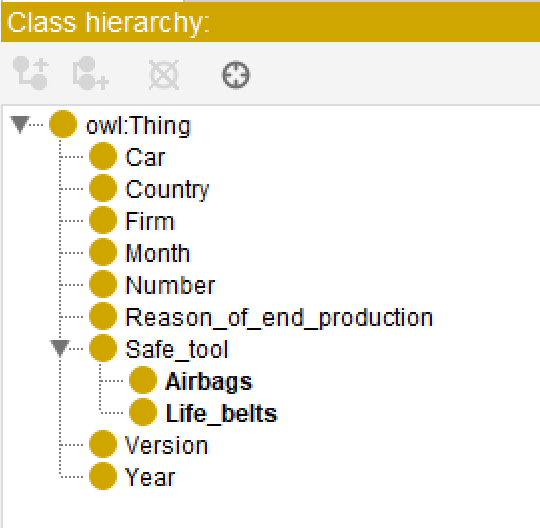
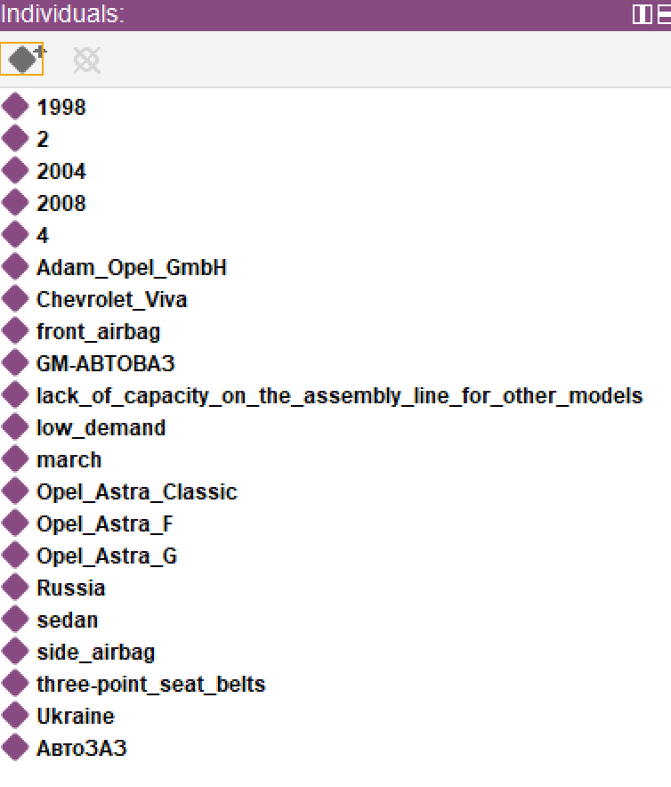

## Практические задания по предмету "Представление и обработка информации в интеллектуальных системах"

### Цель:
* научится формализовать текст
* познакомится с редакторами формализации

### Варианты заданий: 
1) Вариант 29:
    ```
    Opel Astra G — компактный автомобиль фирмы Adam Opel GmbH сменивший Astra F в 1998
    году. В Российской Федерации фирма GM-АВТОВАЗ начала производство Opel Astra G в
    версии седан в 2004 году под названием Chevrolet Viva. В марте 2004 года производство было
    прекращено из-за низкого спроса. В Украине автомобиль собирали на заводе АвтоЗАЗ с 2004

    по конец 2008 года под названием Opel Astra Classic. Производство было остановлено из-за
    нехватки мощностей на конвейере под другие модели. Автомобиль снабжён трёхточечными
    ремнями безопасности, четырьмя подушками безопасности (две фронтальные и две боковые,
    спрятанные в спинках передних сидений).
    ```

2) Вариант 12:
    
    


## Редактор KBE:
Первое задание: 
    
    
    

Второе задание:
    

## Редактор Protege:
Формализация в виде графа: 
    

Структура проекта в Protege:

1) Classes:
   
   

2) Object Properties:
    
    

3) Data Properties:
    
    

4) Individulas: 
   
   

## Вывод:

Изучил правила формализации текста, выполнил задания, выданные преподавателем, в редакторах **KBE** и **Protege**.

## Используемая литература

* <a href="https://protegeproject.github.io/protege/"> Установка и синтаксис</a>
* <a href="https://drive.google.com/drive/folders/1zQF0KtRTaKJJu4rvXSxls0AlobdYUDx5"> Небольшой гайд по Protege  и KBE, материалы с заданием