# Практическое задание по предмету «Представление и обработка информации в интеллектуальных системах».

## Цель
* Научиться формализовать текст
* Познакомиться с редакторами для формализации 

## Задачи
* Выполнить свой вариант задания в двух редакторах KBE и Protege

## Вариант
### Для первой части мне был выдан вариант №4

4. Площадь круга равна 5П квадратных сантиметров. Вписанный угол АBCравен 36 градусов.
Центр круга – О – является одновременно и вершиной центрального угла АОВ, и вершиной
равностороннего треугольника АОВ, чья площадь в семь раз меньше площади исходного круга.

### Для второй части мне был выдан вариант №8
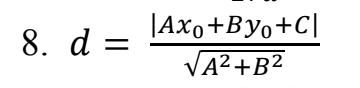
## Выполнение работы

### 1-ое задание
1) **KBE**
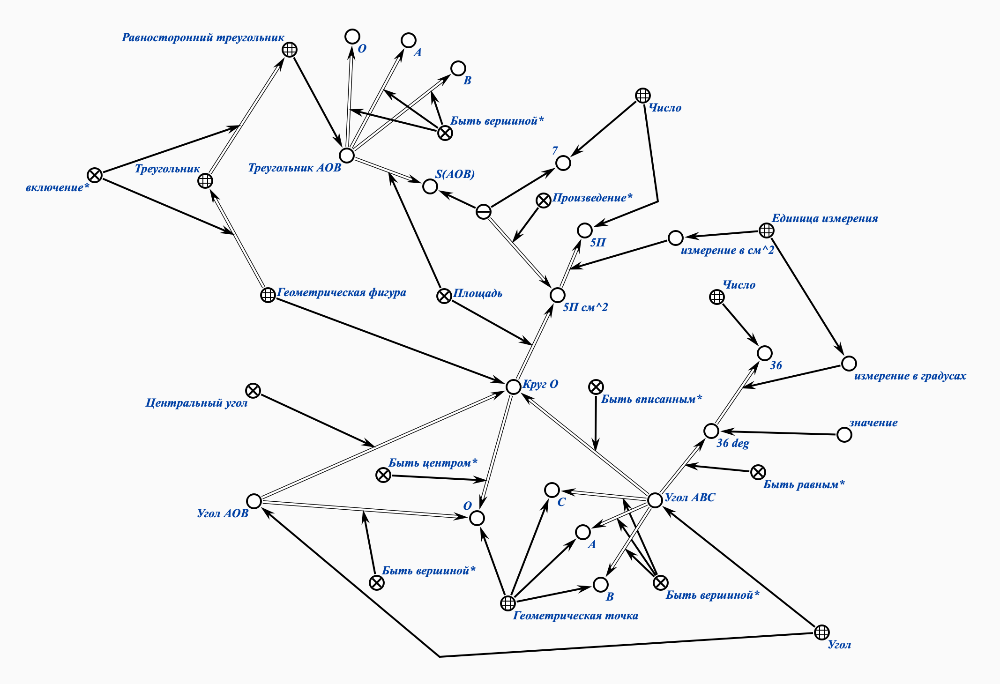
2) **Protege**
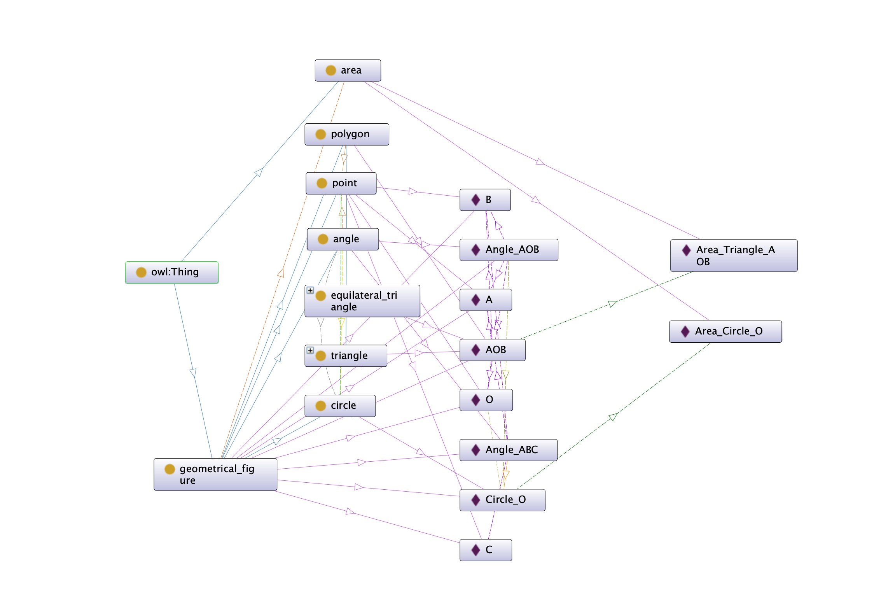
### Структура проекта в Protege

Classes

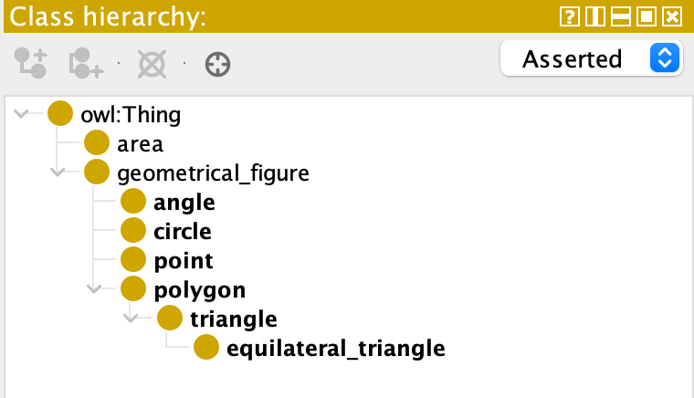

Object properties

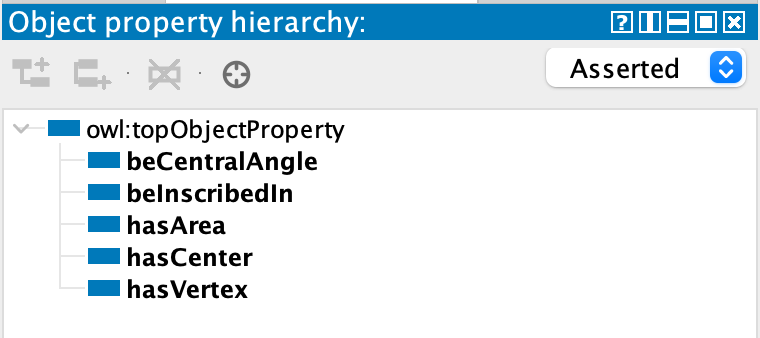

Data properties

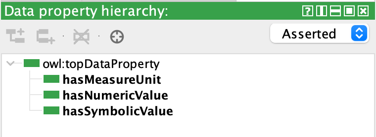

Individuals by class

**Class: point**

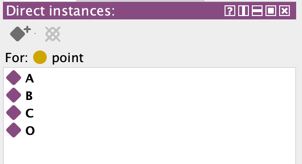

**Class: angle**

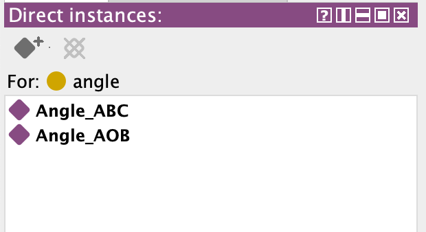

**Class: equilateral_triangle**

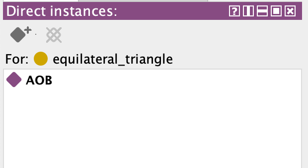

**Class: area**

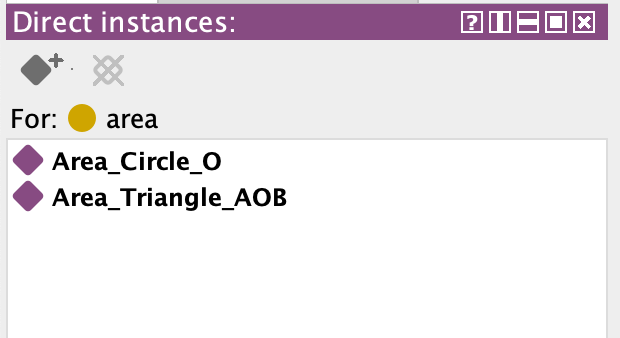

**Class: circle**

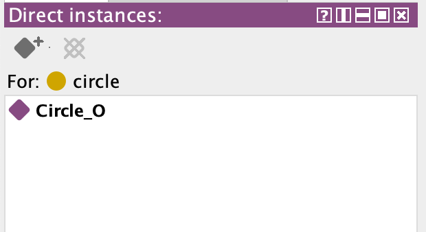
### 2-ое задание
**KBE**
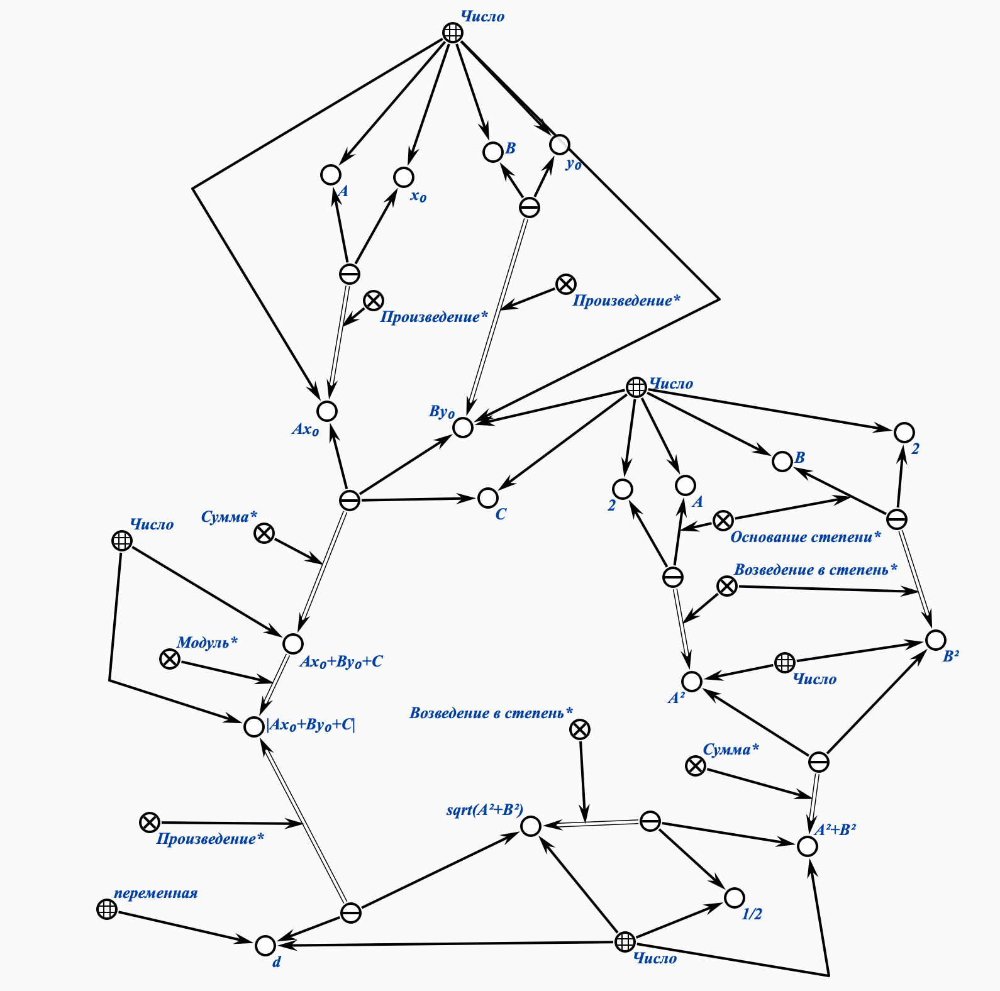
## Вывод:
Изучил правила формализации текста, выполнил задания, выданные мне преподавателем, в редакторах **KBE** и **Protege**.
## Используемые источники
* [Документация Protege](https://protegeproject.github.io/protege/)
* [Небольшой гайд с примерами по KBE и Protege, материалы с заданиями](https://drive.google.com/drive/folders/1zQF0KtRTaKJJu4rvXSxls0AlobdYUDx5) 
* [Ввод в онтолгии. Начало курса по Protege](https://youtu.be/VIpV-hVo3bY?si=FmJcXAXwSuKXNCaR)