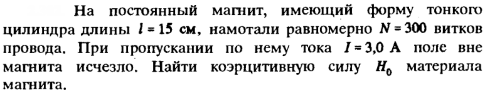
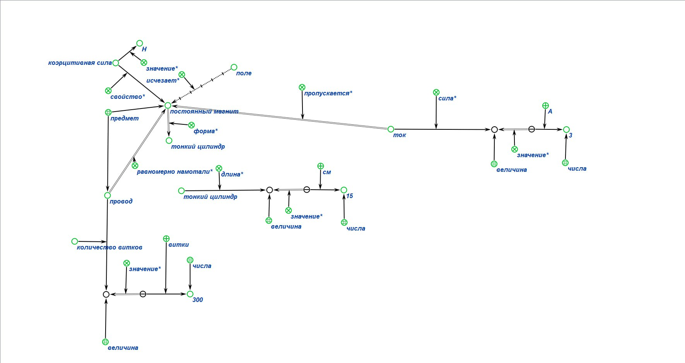
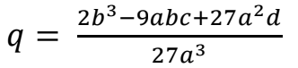
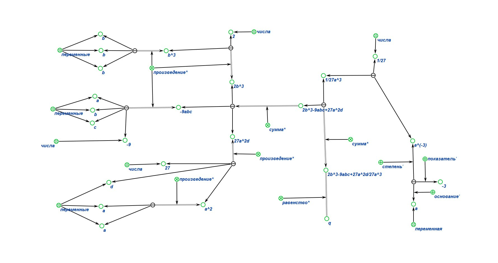

# Практические занятия

## Тема
Формализация

## Цель
Научиться формализвать знания с помощью редакторов баз знаний (KBE и Protege).

---

## Первая задача

### Её реализация в КВЕ

### Её реализация в Protege

---

## Вторая задача

### Её реализация в КВЕ

---

## Вывод
В ходе работы я изучила и на практике освоила основы формализации знаний  с помощью редакторов баз знаний (KBE и Protege)..
