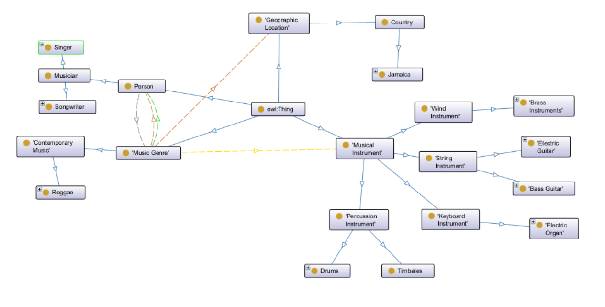
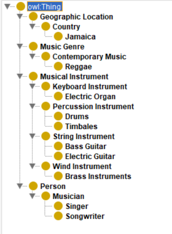
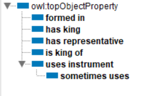
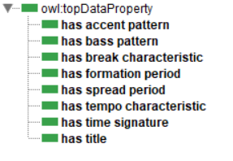

## Практическое задание 

## Цель:
* Научиться формализовать текст
* Познакомиться с редакторами для формализации текста

##  Задачи:
* Выполнить задание в редакторе Protege

## Вариант 24

```
Регги — направление современной музыки, сформировавшееся на Ямайке в конце 1960-х и
получившее широкое распространение с начала 1970-х годов. Используемый состав —
электрогитара, бас-гитара, ударные, электроорган, иногда — группа духовых инструментов.
Основные особенности регги — умеренный (может быть и быстрый, но не агрессивный) темп,
размер — 4/4, акценты в аккомпанементе на 2-й и 4-й доле, синкопированный рисунок баса
(сильные доли такта игнорируются или сдвигаются), брейки на высоких тонах или тимбалес.
Признанным королём регги является певец и автор песен Боб Марли.
```


## Выполнение работы в Protege:



### Структра проекта в  Protege

**1) Classes**



**2) Object properties**



**3) Data properties**




## Вывод:

Изучил правила формализации текста, выполнил задания, выданные преподавателем, в редакторах **KBE** и **Protege**.

## Используемые источники

* <a href="https://protegeproject.github.io/protege/"> Установка и синтаксис</a>
