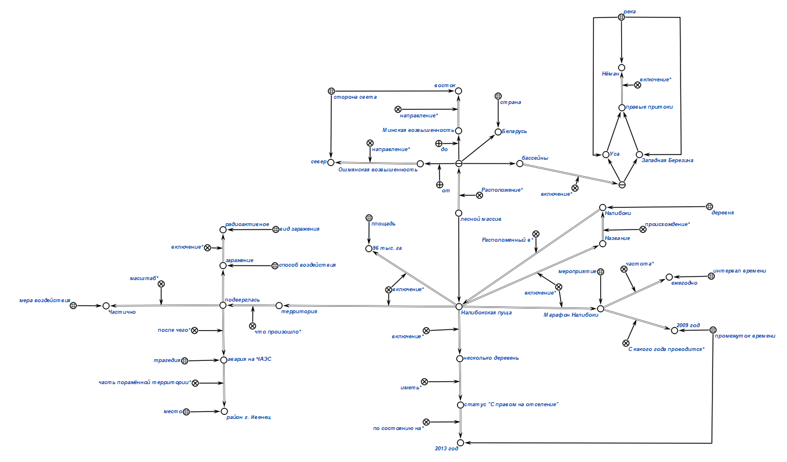

# Самостоятельная работа
---
* Задание 1 (вариант 15)

KBE:
-------

Protege:
-----

Описание классов:

Описание отношений, связывающих между собой экземпляры классов:

Экземпляры классов:

Связывание экземпляров классов с отношениями и классами:

