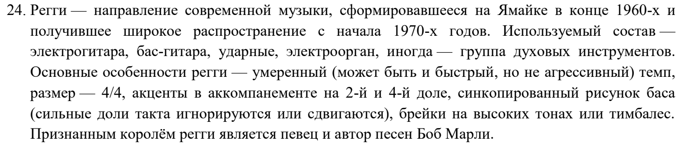
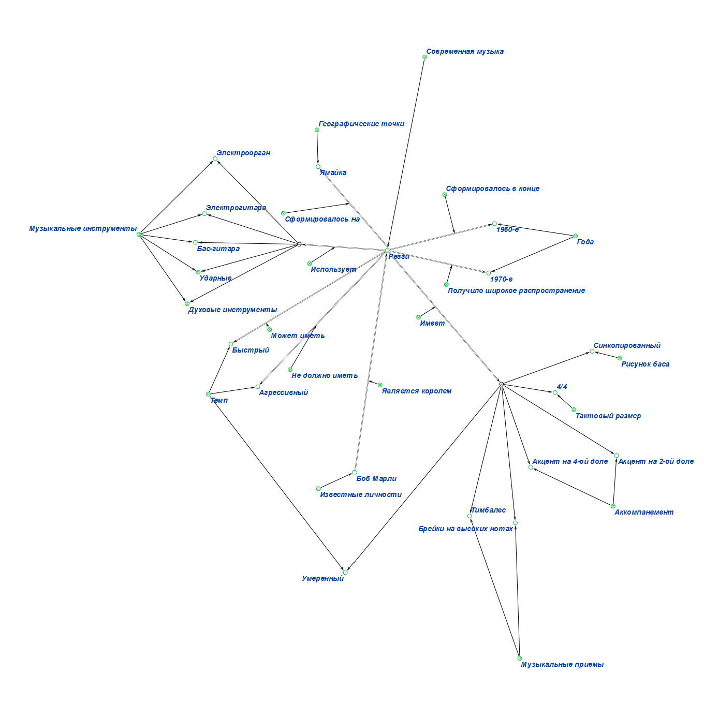

# Самостоятельная работа по ПиОИвИС
## Вариант 15
# Цель работы:
Ознакомится со стандартами технологии **OSTIS**, язык **SCg-code**. Так же познакомиться с работой
в редакторе построения баз данных **Protégé** и формализации **KBE**. Изучить стандарт консорциума **W3C**.
***
# Задание:
1. Дан текст, нужно его формализовать в двух вариантах:
    - При помощи стандарта консорциума W3C, используя редактор **Protégé**.
    - При помощи стандартов технологии **OSTIS**, используя редактор **KBE** и язык **SCg**.

    Сам текст(для **Protégé** вариант *24*, а для **KBE** вариант *24* (это текстовая задача) и вариант *2* (это 
    математическое выражение))

    
    
***
# Решение:
1. Формализация текста:
   - в [**Protégé**](https://github.com/iis-42x70x/RPIIS/blob/%D0%96%D0%B8%D0%BB%D0%B8%D0%BD_%D0%98/sem2/%D0%9F%D0%97/Var24.rdf)
   - в [**KBE**](https://github.com/iis-42x70x/RPIIS/blob/%D0%96%D0%B8%D0%BB%D0%B8%D0%BD_%D0%98/sem2/%D0%9F%D0%97/Var24.gwf)
   
2. Формализация математического выражения:
   - в [**KBE**](https://github.com/iis-42x70x/RPIIS/blob/%D0%96%D0%B8%D0%BB%D0%B8%D0%BD_%D0%98/sem2/%D0%9F%D0%97/Var4.rdf) 
   
***
# Вывод:
В ходе работы заданный текст был формализован при помощи стандартов консорциума W3C, используя редактор Protégé, а также
при помощи стандартов технологии OSTIS, используя редактор KBE и язык SCg. Кроме того, при помощи тех же стандартов
технологии OSTIS, используя редактор KBE и язык SCg, было формализовано математическое выражение.
***
