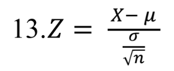
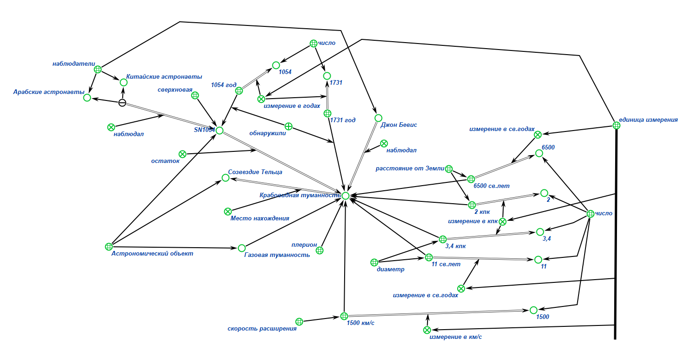
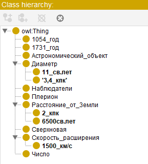
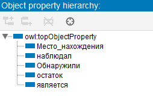
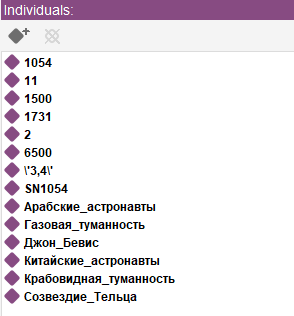
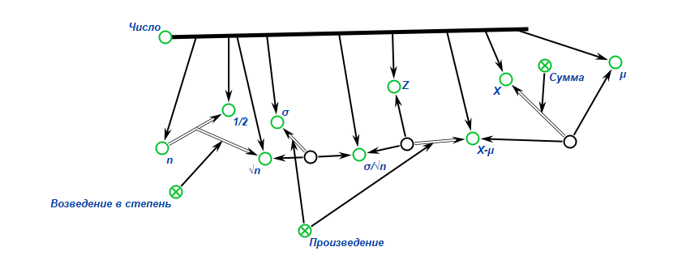

## Практическое задание ##

## Цель:
* Научиться формализовать текст
* Познакомиться с редакторами для формализации текста

##  Задачи:
* Выполнить свои варианты в двух редакторах  KBE и Protege

## Вариант: №18 и  №13
### Для первой части практического задания был выдан вариант **№23**

```
Крабовидная туманность — газообразная туманность в созвездииТельца, являющаяся остатком
сверхновой SN 1054 и плерионом. Туманность первым наблюдал Джон Бевис в 1731 году. Она
стала первым астрономическим объектом отождествлённым с историческим взрывом
сверхновой, записанным китайскими и арабскими астрономами в 1054 году. Расположенная на
расстоянии около 6500 световых лет (2 кпк) от Земли, туманность имеет диаметр в 11 световых
лет (3,4 пк) и расширяется со скоростью около 1500 километров в секунду.
```

### Для второй части практического задания был выдан вариант **№14**



## Выполнение работы (1 задание):

### **1)** **KBE**



### **2)** **Protege**

**1) Classes**



**2) Object properties**



**3) Individuals**



## Выполнение работы (2 задание):

**KBE**



## Вывод:

Изучила правила формализации текста, выполнила задания, выданные преподавателем, в редакторах **KBE** и **Protege**.
